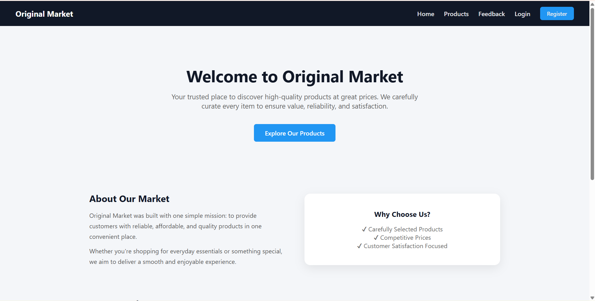
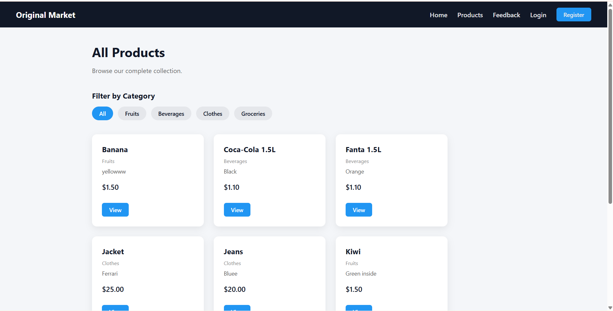
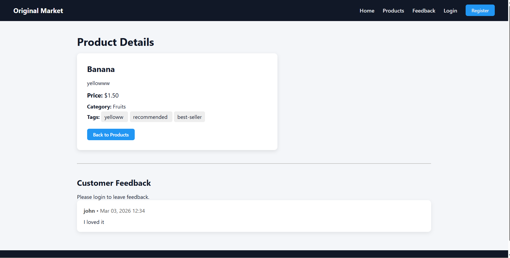
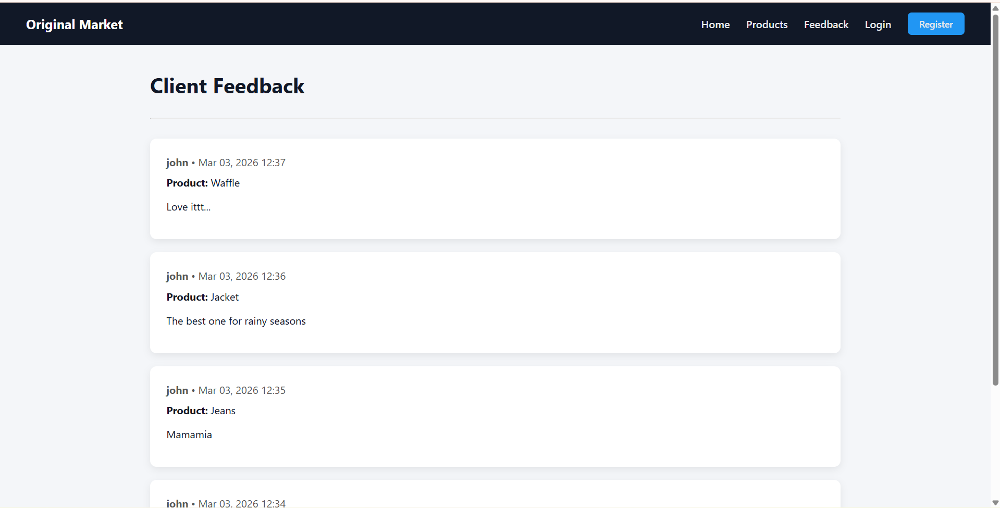
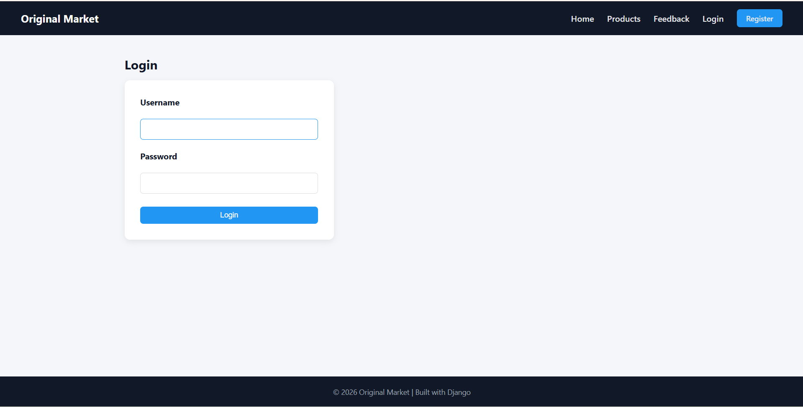
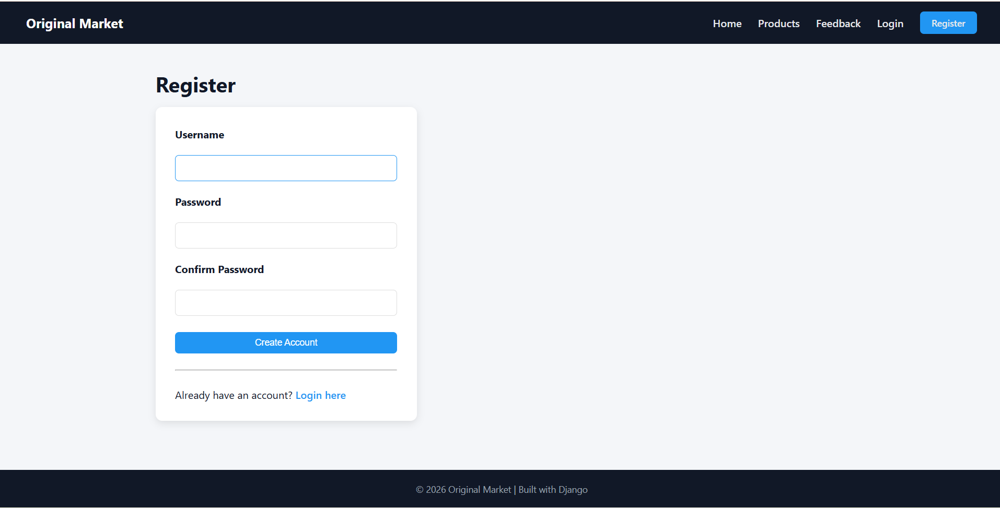

# DSCC 16989 Django Project

## Overview

`DSCC_16989_Project` is a full‑stack Django web application built to meet academic requirements for
Django development, containerization, and production deployment. It ships with user authentication,
relational data models, a simple feedback system, Docker configuration, and a working Git workflow.

The codebase is intentionally readable and extensible, making it a good starting point for small
e‑commerce or catalog applications.

---

## Key Features

- **Authentication**
  - Register new users and immediately log them in
  - Login / logout views using Django's built‑in forms
  - Protected pages for adding feedback and managing content

- **Homepage**
  - Displays the three most recently created products

- **Product catalogue**
  - List view with optional category filtering via `?category=<id>` query string
  - Detail view showing product information and associated feedback
  - Staff‑only product creation, editing and deletion (checked with `UserPassesTestMixin`)

- **Feedback system**
  - Authenticated users may leave comments on products
  - Users may edit/delete their own feedback; staff users may moderate all feedback
  - Feedback list view ordered by most recent

- **Category/tag relationships**
  - `Category` one-to-many with `Product`
  - `Tag` many-to-many with `Product` (selected with checkboxes on the form)

- **Admin interface**
  - All models (`Category`, `Tag`, `Product`, `Feedback`) registered
  - Staff users can manage data via `/admin/`

- **Testing**
  - Basic smoke tests for model string representations and key views
  - Run with `python manage.py test` (uses in-memory SQLite during tests)

---

## Database Models (in `main/models.py`)

| Model      | Fields / Relationships |
|------------|------------------------|
| Category   | `name : CharField` (100)
| Tag        | `name : CharField` (100)
| Product    | `name`, `description`, `price` + FK → `Category` + M2M → `Tag`|
| Feedback   | FK → `Product`, FK → `auth.User`, `message`, `created_at` |

Each model implements `__str__` for readable representations; `Product` is ordered by name.

---

## 🧩 Application Behaviour

1. **Unauthenticated visitors** can browse the home page and product list/detail pages.
2. **Authenticated users** may leave feedback and view the feedback listing page.
3. **Staff users** (is_staff) may add/edit/delete products and moderate feedback.
4. The product form (`main/forms.py`) is a `ModelForm` with a checkbox widget for tags.
5. Views use class‑based generics (`ListView`, `DetailView`, `CreateView`, etc.)
   with appropriate mixins (`LoginRequiredMixin`, `UserPassesTestMixin`).
6. URL configuration in `main/urls.py` shows all available routes, including login/logout
   and registration.

---

## 🧠 Code Walkthrough

Below are key portions of the source code with commentary.  Familiarity with the
standard Django project layout will help when exploring the repository.

### 📦 Models (`main/models.py`)

```python
from django.db import models
from django.contrib.auth.models import User


class Category(models.Model):
    name = models.CharField(max_length=100)

    def __str__(self):
        return self.name


class Tag(models.Model):
    name = models.CharField(max_length=100)

    def __str__(self):
        return self.name


class Product(models.Model):
    name = models.CharField(max_length=255)
    description = models.TextField()
    price = models.DecimalField(max_digits=10, decimal_places=2)

    # one‑to‑many relationship to Category
    category = models.ForeignKey(
        Category,
        on_delete=models.CASCADE,
        related_name='products'
    )

    # many‑to‑many relationship to Tag
    tags = models.ManyToManyField(
        Tag,
        related_name='products',
        blank=True
    )

    def __str__(self):
        return self.name

    class Meta:
        ordering = ['name']


class Feedback(models.Model):
    product = models.ForeignKey(
        Product,
        on_delete=models.CASCADE,
        related_name='feedbacks'
    )

    user = models.ForeignKey(
        User,
        on_delete=models.CASCADE,
        related_name='feedbacks'
    )

    message = models.TextField()
    created_at = models.DateTimeField(auto_now_add=True)

    def __str__(self):
        return f"{self.user.username} - {self.product.name}"
```

> Each model defines a `__str__` method for easy representation in the admin
> and the shell.  The `ordering` meta option on `Product` makes lists sort by
> name automatically.

### 🧩 Forms (`main/forms.py`)

```python
from django import forms
from .models import Product

class ProductForm(forms.ModelForm):
    class Meta:
        model = Product
        fields = ['name', 'description', 'price', 'category', 'tags']
        widgets = {
            'tags': forms.CheckboxSelectMultiple(),
        }
```

> The form uses a `CheckboxSelectMultiple` widget so that tags are displayed as
> a checklist instead of the default multi‑select box.

### 🧑‍💻 Views (`main/views.py`)

Class‑based generic views power most of the application.  Here is the product
list view with filtering logic:

```python
class ProductListView(ListView):
    model = Product
    template_name = 'main/products.html'
    context_object_name = 'products'

    def get_queryset(self):
        queryset = Product.objects.all()
        category_id = self.request.GET.get('category')

        if category_id:
            queryset = queryset.filter(category__id=category_id)

        return queryset

    def get_context_data(self, **kwargs):
        context = super().get_context_data(**kwargs)
        context['categories'] = Category.objects.all()
        return context
```

> Users can restrict the product list by appending `?category=<id>` to the URL.
> The `get_context_data` override adds the full category list so the template can
> display a filter menu.

Other create/update/delete views extend `LoginRequiredMixin` and
`UserPassesTestMixin`, implementing `test_func` to restrict actions to staff
users only.  Feedback views check ownership in their `dispatch` methods to
prevent unauthorized edits.

### 🔗 URL Configuration (`main/urls.py`)

```python
from django.urls import path
from django.contrib.auth import views as auth_views
from .views import (
    home,
    ProductListView,
    ProductDetailView,
    ProductCreateView,
    ProductUpdateView,
    ProductDeleteView,
    FeedbackCreateView,
    FeedbackListView,
    FeedbackUpdateView,
    FeedbackDeleteView,
    register,
)

urlpatterns = [

    path('', home, name='home'),

    path('products/', ProductListView.as_view(), name='products'),
    path('product/<int:pk>/', ProductDetailView.as_view(), name='product_detail'),
    path('product/add/', ProductCreateView.as_view(), name='product_add'),
    path('product/<int:pk>/edit/', ProductUpdateView.as_view(), name='product_update'),
    path('product/<int:pk>/delete/', ProductDeleteView.as_view(), name='product_delete'),

    path('product/<int:pk>/feedback/add/', 
         FeedbackCreateView.as_view(), 
         name='feedback_create'),

    path('feedback/<int:pk>/edit/', 
         FeedbackUpdateView.as_view(), 
         name='feedback_update'),

    path('feedback/<int:pk>/delete/', 
         FeedbackDeleteView.as_view(), 
         name='feedback_delete'),

    path('feedback/list/', 
         FeedbackListView.as_view(), 
         name='feedback_list'),

    path('login/', 
         auth_views.LoginView.as_view(template_name='main/login.html'), 
         name='login'),

    path('logout/', 
         auth_views.LogoutView.as_view(next_page='home'), 
         name='logout'),

    path('register/', register, name='register'),
]
```

> The `auth_views` from Django are used for login/logout with custom templates.

### ⚙️ Settings Highlights (`core/settings.py`)

The configuration loads environment variables via `python-dotenv`:

```python
SECRET_KEY = os.getenv("SECRET_KEY")
DEBUG = os.getenv("DEBUG", "False") == "True"
ALLOWED_HOSTS = os.getenv("ALLOWED_HOSTS", "").split(",")
```

Database settings switch to an in-memory SQLite database when running tests
(`"test" in sys.argv`).  Static and media roots are defined along with
`whitenoise` storage for serving static assets in production.

### 📄 Templates example

A snippet from `main/templates/main/product_form.html` shows how forms are
rendered:

```html
<form method="post">
  {{ form.non_field_errors }}
  <div class="field">
    {{ form.name.label_tag }}<br>
    {{ form.name }}
  </div>
  <!-- ... other fields ... -->
  <button type="submit">Save</button>
</form>
```

Feedback is added to the product detail page using an inline form or a link to
the dedicated feedback create view.

---

## 🛠 Database & Tests

Run the standard migration commands to create schema:

```sh
python manage.py makemigrations
python manage.py migrate
```

Create a superuser for admin access:

```sh
python manage.py createsuperuser
```

Execute the existing smoke tests with:

```sh
python manage.py test main
```

The tests use the in‑memory SQLite database, so they run quickly without
affecting your development PostgreSQL instance.

---


## Local Development

### A. Using Docker (recommended)

1. Clone the repository:
   ```sh
   git clone https://github.com/00016989/DSCC_16989_Project.git
   cd DSCC_16989_Project
   ```
2. Add a `.env` file in the project root containing the environment variables (see below).
3. Build and start the containers:
   ```sh
   docker-compose up --build
   ```
4. Visit <http://localhost> in your browser. The default Django admin is at `/admin/`.

### B. Traditional Django workflow (without Docker)

1. Create and activate a virtual environment (Python 3.12+):
   ```sh
   python -m venv venv
   venv\Scripts\activate    # Windows
   source venv/bin/activate   # macOS/Linux
   ```
2. Install dependencies:
   ```sh
   pip install -r requirements.txt
   ```
3. Set environment variables manually or via a `.env` file;
   the project uses `python-dotenv` to load them automatically.
4. Run migrations and start the development server:
   ```sh
   python manage.py migrate
   python manage.py runserver
   ```

> **Note:** the default database for non‑Docker development can be switched to SQLite
> by leaving the `POSTGRES_*` variables unset.

---

## Deployment Instructions

1. Ensure all production environment variables are configured and
   `DEBUG=False`.
2. Configure `ALLOWED_HOSTS` appropriately.
3. Build and launch with Docker Compose:
   ```sh
   docker-compose up -d --build
   ```
4. Nginx (in the `nginx/default.conf` file) will serve static assets and reverse‑proxy
   requests to Gunicorn running the Django app.

---

## Docker Architecture

- **web** – Django application served by Gunicorn
- **db** – PostgreSQL database
- **nginx** – Reverse proxy/static server

Persistent volumes store Postgres data, static files, and media uploads. The configuration
is located in `docker-compose.yml` and `nginx/default.conf`.

---

## Environment Variables

| Variable         | Purpose                                           |
|------------------|---------------------------------------------------|
| SECRET_KEY       | Django secret key                                 |
| DEBUG            | "True" or "False"                              |
| POSTGRES_DB      | Database name                                     |
| POSTGRES_USER    | Database user                                     |
| POSTGRES_PASSWORD| Database password                                 |
| POSTGRES_HOST    | Database host (e.g. `db` for Docker service)     |
| POSTGRES_PORT    | Database port (default `5432`)                   |
| ALLOWED_HOSTS    | Comma‑separated list of allowed domains/IPS       |

During tests the project falls back to an in‑memory SQLite database for speed.

---

## Project Structure
```
DSCC_16989_Project/
├── core/                  # Primary configuration (settings, wsgi, urls)
├── main/                  # Application with models, views, forms, templates
│   ├── migrations/        # Auto‑generated migration files
│   ├── templates/         # HTML templates for pages and auth
│   └── tests.py           # Basic unit tests
├── nginx/                 # Nginx configuration used in Docker
├── Dockerfile
├── docker-compose.yml
├── requirements.txt
├── .dockerignore
├── .gitignore
└── README.md
```

---

## Future Improvements

- Full‑text search on products
- User profiles and avatars
- REST API endpoints (Django REST Framework)
- Redis or Memcached caching
- Pagination on lists

---

## Version Control

- Hosted on GitHub: `github.com/00016989/DSCC_16989_Project`
- Feature branch workflow with descriptive commits
- Sensitive data excluded via `.gitignore`

Thank you for reviewing the project! Feel free to fork, modify, and extend it for your own
learning or deployment needs.


## Screenshots

### Home Page


### Product List


### Product Detail


### Feedback List


### Login Page


### Register Page
